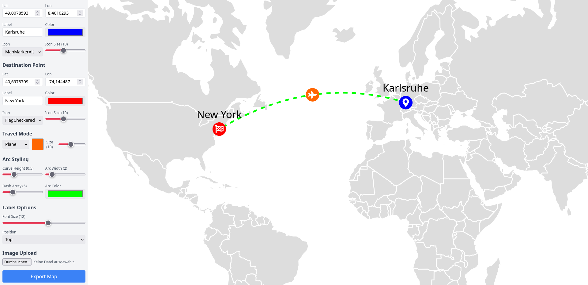
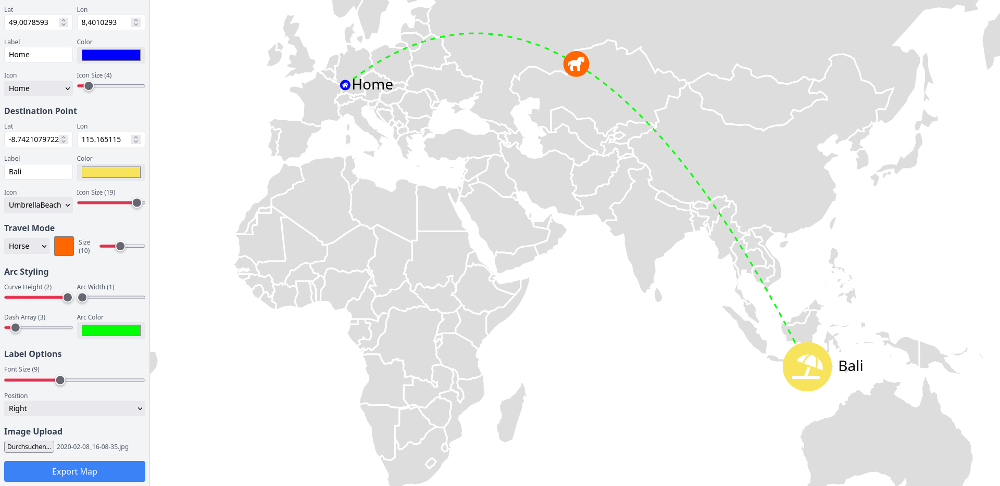
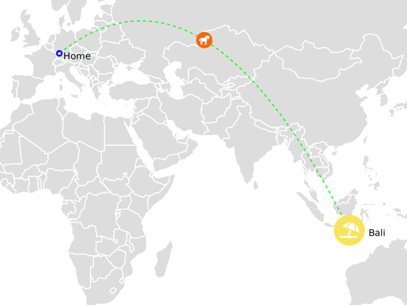

# Dynamic Travel Path Visualizer

## TL;DR

Dynamic Travel Path Visualizer is a tool designed for showcasing travel routes on a world map. Originally inspired by a photobook project, it visualizes trips from home to various destinations with customizable markers and travel modes like flights, cars, and trains. Highlights include **SVG export** with auto-generated file names, interactive controls, and extensibility for additional travel modes (PRs welcome!).

- - -

## Project Overview

The **Dynamic Travel Path Visualizer** is an interactive tool designed to map travel routes on a **world map**. Originally created to visualize flight paths for a photobook project, it now supports additional travel modes like cars and trains, with flexibility to add more in the future.

*   **Customizable World Map:** Visualize routes with origin and destination markers, arcs for travel paths, and labels.
*   **Zoom Control:** Adjust the map view dynamically to focus on specific regions or see the bigger picture.
*   **Flight Path Visualization:** Create curved arcs representing travel routes across the globe.
*   **SVG Export:** Save your visualizations as scalable vector graphics (SVG), with file names automatically generated based on origin, destination, and travel mode.

- - -

## Features

*   **Interactive World Map:** Display travel routes between customizable origin and destination points with labels and icons.
*   **Support for Multiple Travel Modes:** Visualize flights, car trips, train journeys, and more. Easily extendable for additional modes of travel.
*   **Dynamic Path Styling:** Adjust the curve height, width, and dash style of travel arcs for a personalized look.
*   **Customizable Markers:** Choose icons, colors, and sizes for origin and destination points.
*   **Zoom Controls:** Navigate and explore the world map by zooming in and out to focus on specific regions.
*   **GPS Data Extraction:** Automatically extract GPS coordinates from images to set travel destinations with ease.
*   **SVG Export:** Generate high-quality SVGs for sharing or further editing. File names are dynamically created based on the trip details:

*   **Example:** `Home-London-by-Plane.svg`

- - -

## Installation

1.  **Clone the Repository:**
    
    git clone https://github.com/scharc/Dynamic-Travel-Path-Visualizer.git
    cd Dynamic-Travel-Path-Visualizer
                
    
2.  **Install Dependencies:**
    
    npm install
                
    
3.  **Start the Development Server:**
    
    npm start
                
    
    Open [http://localhost:3000](http://localhost:3000) in your browser to view the app.
    
4.  **Build for Production:**
    
    npm run build
                
    
    This generates static files in the `build` directory, ready for deployment.
    

- - -

## Usage

1.  **Adding a Trip:**
    *   Specify the **origin** and **destination** using coordinates or by selecting from the map.
    *   Customize markers for the origin and destination with different icons, colors, and sizes.
2.  **Customizing Travel Paths:**
    *   Choose a travel mode: flights, car trips, train journeys, or others.
    *   Adjust the arc style by modifying curve height, width, and dash patterns.
    *   Change the zoom level to focus on specific areas of the map.
3.  **Extracting Destinations from Images:**
    *   Upload an image with GPS metadata, and the destination will be automatically set based on the extracted coordinates.
4.  **Exporting as SVG:**
    *   Save your visualizations as **SVG files** with auto-generated file names:
    
    *   **Origin** and **Destination** names
    *   **Travel mode**
    *   **Example:** `Home-London-by-Plane.svg`
    
    *   Files are high-quality and scalable, perfect for printing or further editing.

- - -

## Screenshots

#### 1\. Interactive World Map

Visualize travel paths on a dynamic world map with customizable markers, arcs, and zoom controls.

#### 2\. GPS Data Extraction

Easily extract GPS coordinates from images and automatically set destinations.

#### 3\. SVG Export

Export high-quality SVGs with auto-generated filenames for seamless sharing and editing.

- - -

## Contributing

Contributions are welcome! Here’s how you can help:

1.  **Feature Suggestions:**
    *   Have ideas for new travel modes or additional features? Open an issue to discuss.
2.  **Pull Requests:**
    *   Add new travel modes or improve existing functionality.
    *   Ensure the code follows existing conventions and is well-documented.
3.  **Bug Reports:**
    *   If you encounter any issues, please report them via GitHub Issues with steps to reproduce the problem.
4.  **Customizations:**
    *   Enhance SVG export features, map styling, or introduce new marker customization options.

- - -

## License

This project is licensed under the **MIT License**. See the [LICENSE](./LICENSE) file for details.